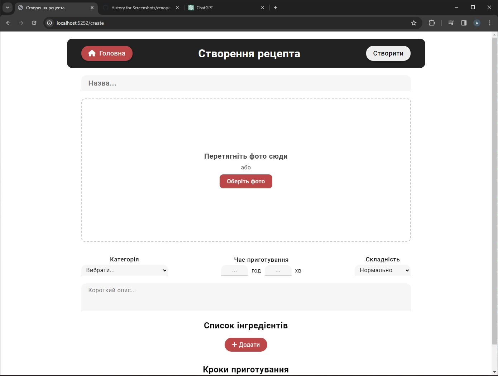

## Рецепти приготування страв
**Проект "Рецепти приготування страв"** - це веб-додаток, основою якого є **рецепти та їх харчова цінность**. Головна ідея проекту полягає у створенні, редагуванні та перегляді рецептів користувачами сайту. Наприклад, якщо Ви захотіли приготувати рибні котлети то для того, щоб знати як їх приготувати, достатньо буде на головній сторінці написати у пошуку "котлети" або "рибні котлети" та вибрати один з рецептів, створених користувачами, та покроково зробити все, що написано у ньому, використовуючи **інгредієнти**, які вказані для кожного рецепта. [Відео користування сайтом.](https://www.youtube.com/watch?v=AAtlV8M_Plo)

Також шукати рецепти зручно буде за допомогою **дерева категорій**. Наприклад, якщо Ви захотіли зробити салат, то для того, щоб знайти рецепти салатів з курятини, буде достатньо трьох кліків по дереву категорій _(Салати > Салати з м'ясом > Салати з курятиною)_, щоб Вам відобразило бажані рецепти. 

Цей веб-додаток створений з використанням фреймворків **ASP.NET Core** та **Entity Framework Core**. Написаний на мовах: **C#, HTML, CSS та JavaScript**. Архітектура відповідає принципам **REST API**, а кінцеві точки обробляються за допомогою **Controllers**. Дані зберігаються у **Microsoft SQL Server**. Використовуючи файл [openapi.yaml](/openapi.yaml) кінцеві точки АPI можна переглянути [тут](https://editor.swagger.io/).

Також є один **Hosted Service**, який наслідується від класу **BackgroundService**, призначений для очищення тимчасових фото. **Тимчасові фото** - це кожне фото, яке користувач завантажив у процесі створення рецепту. Якщо він з різних причин буде видаляти та завантажувати нові фото, то завдяки сервісу, невикористані фото видалиться через 1 годину після додавання.

### Сторінка рецепта

Для кожного рецепту є сторінка, яка відображатиме всю інформацію про нього. На першій частині сторінки відображається **назва** рецепту, **фото**, **складність та час приготування**, **короткий опис**, **рейтинг** (формується на основі оцінок користувачів) та **автор** рецепту.

Друга частина сторінки надає інформацію про **інгредієнти** та **калорійність страви**. Докладно вказана інформація скільки **білків**, **вуглеводів**, **жирів** та яка **вага** буде у результаті приготування.

Третя часина сторінки відображає **послідовні кроки приготування страви**, **список коментарів** та панель для їх додавання. Сторінка закінчується **датою створення** рецепта.

### Сторінка створення та редагування рецепта

Після натиснення клавіши створення рецепта відкриється відповідна сторінка у якій буде форма для заповлення інформації про рецепт. Фото можливо додати не тільки натисненням на клавішу "Обрати фото", а тажож перетягуванням його у поле, так званим "Drag and Drop(ом)".

Обов'язковими для заповнення є всі поля. **Категорія** вибирається одна з випадаючого списку. **Час приготування** записується числом в одне або два поля у годинах та хвилинах відповідно. **Складність** обирається таким самим чином, як і категорія. **Назва** та **опис** записуються звичайним текстом.

Для того щоб **додати інгредієнти** треба написнути клавішу "+ Додати" у відповідному блоці. Після натиснення відкриється **список всіх продуктів** з швидким пошуком за ключовим словом. Вибравши продукт і натиснувши на "**+**" біля нього, він буде доданий на сторінку та стане доступним поле для редагування його кількості у вказаних одиницях вимірювання. Один і той самий продукт двічі вибрати - неможливо. У випадку помилкового вибору продукту є можливість його видалити та обрати інший, натиснувши клавішу "x" справа від інгредієнту.

**Кроки приготування** додаються схожим чином до додавання інгредієнтів, але при натисненні клавіши "+ Додати" одразу відбувається додавання поля для опису кроку. Кроки одразу нумеруються, уникаючи випадкової ситуації з перемішуванням їх при відкритті сторінки перегляду рецепта.

Після створення рецепту, може статись таке, що Ви помилились при написанні слова чи щось інше, тому для вирішення цієї проблеми є сторінка **редагування рецепта**. Вона доступна для кожного рецепта у профілю користувача, який буде описаний нижче. Редагування відбувається таким чином, як і створення.

### Сторінка профілю

Кожен зареєсторований користувач має можливість переглянути рецепти, які додав раніше, та їх **загальну статистику** у своєму **профілю**. Також є панель з інформацією про користувача, у якій натиснувши на "**олівець**" буде надана можливість редагувати всі Ваші дані.

### Сторінки входу та реєстрації

А для того щоб створювати, редагувати рецепти та користуватись профілем треба обов'язково **увійти** або **створити новий акаунт** на сторінках входу та реєстрації відповідно.
